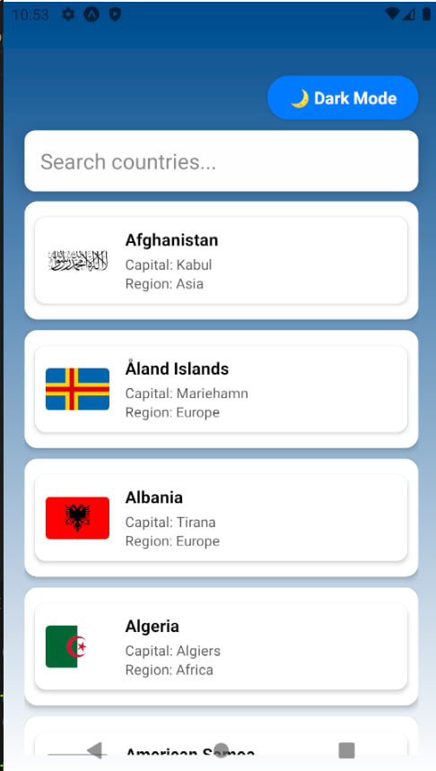
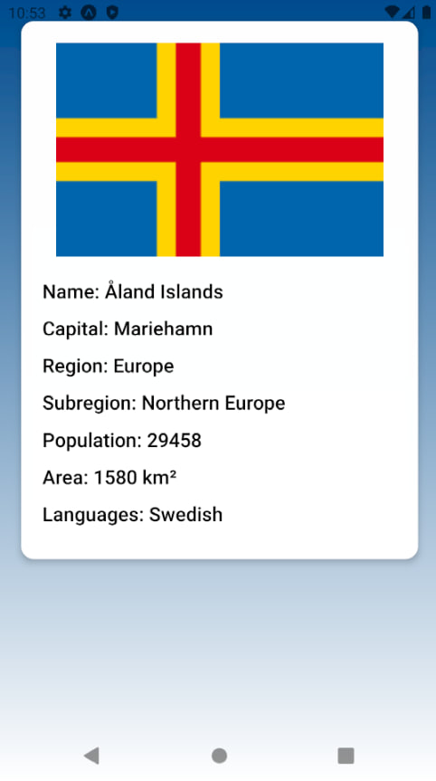
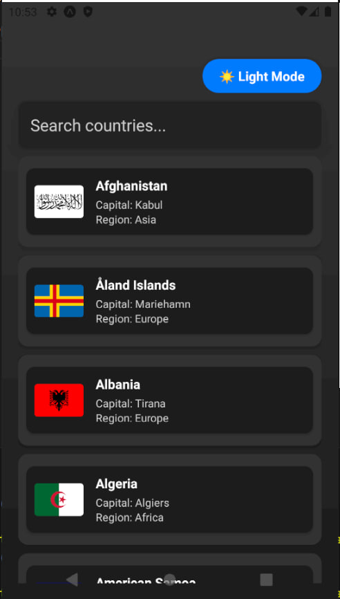
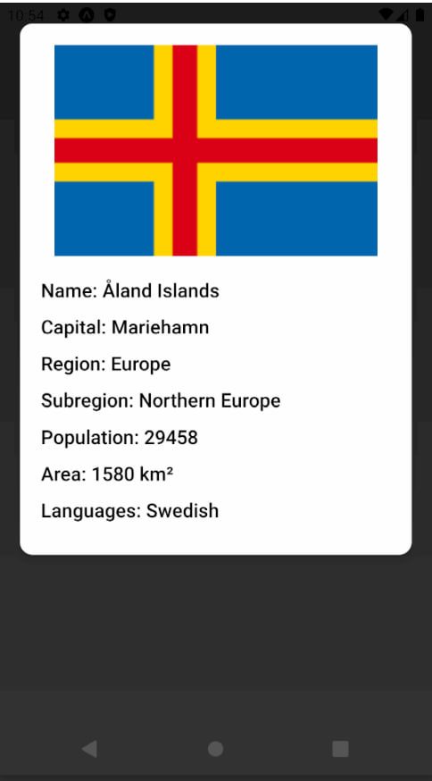

# Country Explorer React Native App

A React Native app that fetches and displays detailed country information using TypeScript interfaces.

---

## How to Run

Using github repo

1. Clone the repository:  
   `git clone https://github.com/URasanjali/Country_info_app`  
2. Open in VS Code 
3. Run `npm install expo`
4. Run `npm install`  
5. Run `npx expo start`
6. Press a for android or follow the instructions in the console
7. press R for reload

Using apk file

1. Install the APK on your Android device
2. Run the app

## Screenshots

### Splash Screen  

### Light Theme  
  

### Dark Theme  
  

---

## Features

- Displays country name and flag  
- Shows capital city (optional)  
- Shows region and subregion  
- Displays population and area  
- Lists languages spoken (optional)  
- Search option with suggestions  
- Switch between light and dark theme  

## Assumptions 
- Have an emulator already start 
- It is recommended to download and install the Expo Go app to emulator or real device (not nessesary but it would be easy)